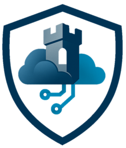
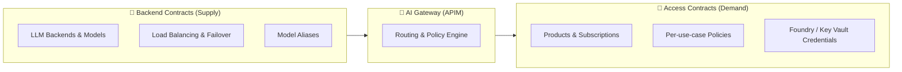

# 🏰 Citadel Governance Hub

<div align="center">
    
    <br>
    <strong>Enterprise AI Landing Zone</strong>
    <br>
    <em>A comprehensive solution accelerator for governing, observing, and accelerating AI deployments at scale with unified security, compliance, and intelligent orchestration.</em>
</div>

---

## 🚀 Overview

Citadel Governance Hub is an **enterprise-grade AI landing zone** that provides a centralized, governable, and observable control plane for AI consumption across teams and environments.

This repository is a **solution accelerator** that helps you deploy and operate the hub using:

- Infrastructure-as-code (Bicep)
- A unified AI gateway pattern (Azure API Management)
- Usage ingestion components (Logic Apps + Azure Functions)
- Validation notebooks and operational guides

## 🏛️ Part of the AI Citadel Blueprint

> [!IMPORTANT]
> This accelerator is the **reference implementation of Layer 1 – Governance Hub** in the [AI Citadel Blueprint](https://aka.ms/foundry-citadel) layered security architecture.

The **AI Citadel Blueprint** is a unified, layered approach to AI security and compliance, designed to enable enterprises to scale AI innovation while maintaining trust, security, and regulatory alignment. The blueprint is composed of four interlocking layers:

| Layer | Name | Responsibility | Implementation |
|-------|------|----------------|----------------|
| 🔷 **Layer 1** | **Governance Hub** | Runtime enforcement — unified AI gateway, policy-as-code, identity validation, token rate limiting, content filtering, cost attribution | **👉 This Accelerator** ([aka.ms/ai-hub-gateway](https://aka.ms/ai-hub-gateway)) |
| 🔶 **Layer 2** | **Agent Operations** | Agent runtime, observability & compliance — agent traces, AI evaluations, fleet operations, automated compliance checks | [Microsoft Foundry Agents & Control Plane](https://learn.microsoft.com/en-us/azure/ai-foundry/control-plane/overview) |
| 🟢 **Layer 3** | **Agent Identity** | Agent identity & lifecycle governance and security — unique agent identities, blueprints, shadow agent detection, sponsorship model, access packages | [Governing Agent Identities with Agent 365](https://learn.microsoft.com/en-us/microsoft-agent-365/) |
| 🛡️ **Layer 4** | **Security Fabric** | Unified protection — `Microsoft Defender` for AI threat intelligence, `Purview` for data governance, `Entra` for authentication and authorization | Microsoft Defender, Purview & Entra |

The layers are not isolated silos — they form an integrated architecture grounded in the principle of **separation of concerns with unified oversight**.

**Layer 1: Governance Hub** (this accelerator) acts as the runtime gateway through a hub-and-spoke deployment where a centrally managed AI gateway (Azure API Management) enforces runtime policies, while spoke environments (layer 2: Agent Operations) give each business unit autonomous development within guardrails.
Adding **Layer 3: Agent Identity** ensures that every agent has a unique, governable identity, while **Layer 4: Security Fabric** provides unified threat protection and data governance across the entire architecture.

> 📎 For the full Citadel Blueprint approach and guidance, visit: [aka.ms/foundry-citadel](https://aka.ms/foundry-citadel)

---

## 🌟 Benefits (Summary)

Citadel Governance Hub helps you standardize AI governance while maintaining developer velocity:

- **Governance & security**: consistent access control, identity patterns, policy enforcement
- **Observability & compliance**: central logging/metrics and near real-time usage analytics
- **Developer velocity**: repeatable onboarding patterns and contract-driven configuration

For a detailed stakeholder- and capability-level breakdown, see [Governance Hub Benefits](./guides/governance-hub-benefits.md).

---

## 🧩 What's in This Repo

At a high level, the accelerator includes:

- [bicep/infra](./bicep/infra): main IaC entrypoint and modules for provisioning the hub in addition to submodules for operational processes.
- [src/usage-ingestion-logicapp](./src/usage-ingestion-logicapp): Logic App workflows for processing usage/log streams and other governance workflows.
- [validation](./validation): Jupyter notebooks for post-deployment validation and onboarding.
- [guides](./guides): operational and architecture documentation.

## 🏗️ Architecture Overview

AI Citadel Governance Hub follows a **Central-Control-Plane** with decentralized **Agent-Execution-Plane** architecture** that integrates seamlessly with your existing `Azure Enterprise Landing Zone` network topology:


### Networking approach

Detailed networking approach guidance for Citadel Governance Hub can be found in the [Network Approach Guide](./guides/network-approach.md).

Below is a high-level overview of the two supported deployment approaches:

#### Part of spoke network (peered to a hub VNet in the connectivity subscription)

In this approach, the Citadel Governance Hub is deployed within a dedicated spoke VNet that connects to the hub VNet via VNet peering.

Agentic workloads in other spokes are routed first to the hub network firewall through direct peering, then forwarded to the Citadel Governance Hub gateway network.

This provides an additional layer of isolation for AI workloads while still enabling secure communication with other enterprise resources in the hub.

This is the recommended approach for large enterprises with strict network segmentation requirements or those who want to isolate AI workloads from other enterprise resources.

#### Part of the enterprise network hub (usually in Connectivity subscription)

In this approach, the Citadel Governance Hub is deployed within the existing enterprise hub virtual network (VNet) of your Azure Enterprise Landing Zone.

This allows for direct communication between the unified AI gateway and connected agentic spokes (as the hub already peered with all spoke networks), leveraging existing networking configurations.

This approach is suitable for enterprises that prefer to integrate the governance hub within their existing network architecture without additional segmentation.

### 🎯 **Citadel Governance Hub Components** - Central Runtime Control Plane

The central governance layer with unified AI Gateway that all AI workloads route through.

#### Core Components

| Component | Classification | Purpose | Enterprise Features |
|-----------|----------------|---------|---------------------|
| **🚪 API Management** | Required | Unified AI gateway | LLM governance, AI resiliency, AI registry gateway |
| **📘 API Center** | Recommended | Universal AI Registry | Discovery of available AI tools, agents and AI services |
| **🔍 Microsoft Foundry** | Required | Control Plane/Models/Observability | Platform LLMs, Control Plane & AI Evaluations |
| **📊 Log Analytics** | Required | Logs, metrics & audits | Scalable enterprise telemetry ingestion and storage |
| **📊 Application Insights** | Required | Platform monitoring | Performance dashboards, automated alerts |
| **📨 Event Hub** | Required | Usage data streaming | Real-time usage streaming, custom logging |
| **🗄️ Cosmos DB** | Required | Usage analytics | Long-term storage of usage, automatic scaling |
| **⚡ Logic App** | Required | Event processing | Workflow-based processing of usage/logs & AI Eval |
| **🔗 Virtual Network** | Required | Private connectivity | BYO-VNET support, private endpoints |

#### Security & Compliance

AI Gateway security & compliance enforcements components:

| Component | Classification | Purpose |Enterprise Features |
|---------|----------------|---------|---------------------|
| **🔐 Managed Identity** | Required | Zero-credential auth | Secure service-to-service communication |
| **🛡️ Content Safety** | Required | LLM protection | Prompt Shield and Content Safety protections (served from the **primary Microsoft Foundry / AI Services** account) |
| **💳 Language Service** | Required | PII detection | Natural language and RegEx based PII entity detection with anonymization support (served from the **primary Microsoft Foundry / AI Services** account) |
| **🔍 Microsoft Foundry** | Recommended | Control Plane | Control plane, responsible AI, registration of external agents  |

Supported by subscription wide security services:

| Component | Classification | Purpose |Enterprise Features |
|---------|----------------|---------|---------------------|
|**Defender for AI**|Recommended|Threat protection|AI workload security posture management|
|**Purview**|Recommended|Data governance|Sensitivity labeling, data classification|
|**Entra ID**|Required|Identity & access management|Zero Trust architecture, conditional access|

#### AI Services

Optionally you can deploy one or more generative AI services as part of the Citadel Governance Hub to provide fully functional gateway with LLMs already integrated:

| Component | Classification | Purpose | Enterprise Features |
|---------|----------------|---------|---------------------|
| **Microsoft Foundry** | Required | Model Catalog | Access to rich foundational model catalog with variety of deployment options and required for Azure Language and Azure Content Safety services |

#### Optional Components

Pluggable components to enhance AI Citadel Governance capabilities:

| Component | Classification | Purpose |
|-----------|----------------|---------|
| **Azure Managed Redis** | Optional | Semantic caching layer for high-throughput AI workloads |

### 🌐 **Agents Onboarding** - for existing and new agents

To govern AI agents through Citadel Governance Hub, agents must communicate with AI backends (central LLMs, tools and agents) through the Citadel's unified AI gateway.

#### Access Contracts

Leverage **Citadel Access Contracts** to declare the required access to LLMs, tools and agents through the gateway along with precise governance policies.

[Access contracts](bicep\infra\citadel-access-contracts\README.md) are infrastructure-as-code declarations of the access requirements and governance policies for an agent, which are then automatically enforced at runtime by the gateway.

>NOTE: Recommendation is to create one contract per business-unit/use-case/environment to allow for precise governance policies and better observability in the hub.

#### Existing agents

Guidance to bring existing agents is through updating endpoint and credentials to access central LLMs, tools and agents through the **unified gateway** endpoint and credentials that are produced by the access contract provisioning for each agent.

>NOTE: Recommendation is to use Azure Key Vault to store these information due to its sensitivity when the agent is running on Azure.

#### New agents (AI Landing Zone for Microsoft Foundry)

Building new agents is accelerated through the **AI Landing Zone for Microsoft Foundry** guidance, which helps enterprises adopt AI faster by offering a governed, secure, and repeatable foundation for deploying AI applications and agents on Azure at scale.

For detailed guidance and technical implementation, see [AI App Landing Zone Repo](https://github.com/Azure/AI-Landing-Zones).

**Deployment Approach:**
- **One Agent Execution Plane per business unit or use case** - Deploy dedicated Foundry landing zone environments for each business unit, such as insurance claims processing, customer support automation, or other agentic scenarios
- **Flexible runtime options** - with Microsoft Foundry Agents (fully managed agent runtime) you get to choose between native Foundry agents or bring-your-own agent container frameworks like LangChain, Microsoft Agent Framework, or custom implementations while still benefiting from the unified governance and security of the hub
- **Pre-configured infrastructure** - Automated deployment via Bicep or Terraform with all networking, security, and monitoring built-in
- **Hub integration** - Seamless connection to Citadel Governance Hub through **Citadel Access Contracts**

**Deployment Patterns:**
- **Greenfield (Standalone with New Resources)** - Creates all infrastructure from scratch with new VNet and Log Analytics workspace
- **Brownfield (Standalone with Existing Resources)** - Integrates with existing enterprise landing zones, reusing VNets and centralized monitoring

>NOTE: As per Citadel Blueprint principles for **Layer 2: Agents Operations**, this landing zone provides a standardized foundation for enterprise AI workloads, with implementation options in Terraform and Bicep deployment. By activating **Access Contracts**, agents deployed in this landing zone can seamlessly integrate with the Citadel Governance Hub for unified runtime governance and observability.

---

## 🔄 Governance Hub Operations - Contract-Driven Governance

Day-to-day operation of the Citadel Governance Hub is **contract-driven**: every change to what the gateway serves and who can consume it is declared as version-controlled infrastructure-as-code (`.bicepparam` files) rather than manual portal configuration. Two complementary contract types govern the two sides of the gateway:

- **🔌 Backend Contracts** — govern the **supply side**: which LLM backends and models the gateway can route to.
- **📝 Access Contracts** — govern the **demand side**: which use cases and agents can consume those models, and under which policies.

Together they create a clean separation of concerns: platform teams curate the available AI capacity once, while business units onboard use cases against that curated capacity without ever touching gateway internals.



### 🔌 Backend Contracts — Onboard LLM backends and models

Declares the **governed AI capacity** the gateway can route to, enabling dynamic backend routing without modifying APIM policies:
- Multi-provider backends (Microsoft Foundry, Azure OpenAI, Amazon Bedrock, external/OpenAI-compatible providers)
- Automatic load balancing and failover across backends serving the same model
- Model aliases that abstract a client-facing name over multiple underlying models (with priority/weighted routing)
- Dynamic model discovery (`GET /deployments`) so clients and Microsoft Foundry can enumerate available models

> 🔗 **Learn More:** [Governance Hub Backend Contract Guide](./bicep/infra/llm-backend-onboarding/README.md)

### 📝 Access Contracts — Onboard use cases and agents

Declares the governed dependencies an agent or use case needs—LLMs, AI services, tools, and reusable agents—along with precise access policies enforced at runtime by the gateway:
- Model selection and capacity allocation (scoped to the curated backend capacity)
- Per-use-case APIM product, subscription, and policy (one contract per business-unit / use-case / environment)
- Safety and security guardrails (content safety, PII handling, layered API key + JWT authentication, OAuth scopes)
- Usage quotas, cost limits, and flexible credential delivery (Key Vault, Microsoft Foundry connection, or direct output)

> 🔗 **Learn More:** [AI Citadel Access Contracts Guide](./bicep/infra/citadel-access-contracts/README.md)

### 📤 Publish Contracts (Upcoming)

Describes the tools and agents a spoke exposes **back** to the hub—publishing rules, ownership metadata, security posture, and discovery/cataloging in the AI Registry.

>NOTE: Publish contracts are upcoming and will be available in future releases.

### ✅ Why Contract-Driven Governance

- ✅ **Separation of concerns** — platform teams manage backends; business units manage their own access contracts
- ✅ **Audit-ready traceability** — every backend and access change is captured as reviewable infrastructure-as-code
- ✅ **Faster release cycles** — repeatable, declarative onboarding with automated approvals via DevOps pipelines
- ✅ **Reduced manual effort** — no manual gateway configuration for onboarding models or use cases
- ✅ **Continuous policy compliance** — guardrails are enforced consistently at runtime for every request

---

## 📋 Deployment Prerequisites (Basic/Fast)

For fast deployment, ensure you have the following prerequisites in place:

**Azure Requirements:**
- **Azure CLI** and **Azure Developer CLI** installed and signed in
- **Owner** or **Contributor + User Access Administrator** permissions on the subscription
- All required subscription resource providers registered (providers are outlined in the [Full Deployment Guide](./guides/full-deployment-guide.md)).

**Tools:**
Although it is recommended to have the below tools installed on a local machine or through DevOps agents to conduct the provisioning, you still can leverage Azure Cloud Shell (mounted to storage account) as an alternative which has all the tools pre-installed.
- [Azure Developer CLI (azd)](https://learn.microsoft.com/azure/developer/azure-developer-cli/install-azd)
- [Azure CLI](https://learn.microsoft.com/en-us/cli/azure/install-azure-cli)
- [VS Code](https://code.visualstudio.com/Download) (optional)

>NOTE: Azure Cloud Shell is a great option for quick deployment without local setup, but for ongoing development and operations, having the tools installed locally or in your DevOps environment along with a git-repo will provide a better experience especially when it comes to production deployments.

---

## 🚀 Quick Deploy

Deploy your Citadel Governance Hub in minutes with Azure Developer CLI:

```bash
# Authenticate and setup environment
azd auth login

# in a new folder, initialize the template (i.e. folder name: ai-hub-citadel-dev)
azd init --template Azure-Samples/ai-hub-gateway-solution-accelerator -e ai-hub-citadel-dev --branch citadel-v1

# Deploy Citadel Governance Hub
azd up
```

> 💡 **Tip**: Use Azure Cloud Shell to avoid local setup. This accelerator is setup by default to deploy ready to use Governance Hub. Review [main.bicepparam](./bicep/infra/main.bicepparam) configuration in case your need adjustments before deployment.

### Transient deployment issues
During deployment, you might encounter transient errors related to resource provisioning, which are common in complex deployments. If you encounter errors, please try to rerun the ```azd up``` command. If the issue persists, please check the error message for specific details and ensure that all prerequisites are met.

> TIP: For bicep deployments, a full list of deployed resources and status can be found in the Azure Portal under the resource group created -> Deployments.

### 🧪 Validation Notebooks

After successful deployment, validate your Citadel Governance Hub setup using our interactive notebooks.

Detailed list and guidance of the available notebooks can be found in the [Validation Notebooks Guide](./validation/README.md), which includes step-by-step instructions to test key functionalities.

---

## 📚 Comprehensive Documentation

Master AI Citadel Governance Hub implementation and operations with our detailed guides:

### 📖 **Concepts & Benefits**

| Guide | Description |
|-------|-------------|
| [**🆕 Governance Hub Benefits**](./guides/governance-hub-benefits.md) | Detailed benefits and stakeholder value of adopting Citadel Governance Hub |
| [**🆕 Citadel Sizing Guide**](./guides/citadel-sizing-guide.md) | Guidance on sizing the Citadel Governance Hub based on workloads and environments |
| [**🆕 PTU Estimation Guide**](./guides/put-estimation-guide.md) | Azure OpenAI / Foundry LLM sizing guide for PTU vs Pay-as-you-Go capacity planning |

### 🏗️ **Landing zone deployment**

| Guide | Description |
|-------|-------------|
| [**🆕 Quick Deployment Guide**](./guides/quick-deployment-guide.md) | Fast deployment for non-production environments |
| [**🆕 Full Deployment Guide**](./guides/full-deployment-guide.md) | Comprehensive guide for dev, staging, and production |
| [**🆕 Parameters Deployment Guide**](./guides/parameters-usage-guide.md) | Comprehensive Bicep parameter file usage |
| [**🆕 Network Approach Guide**](./guides/network-approach.md) | Detailed networking approach for Citadel Governance Hub deployment |

### 🔧 **AI Service Integration**

| Guide | Description |
|-------|-------------|
| [**🆕 LLM Backend Onboarding Guide**](./bicep/infra/llm-backend-onboarding/README.md) | Independent LLM backend routing deployment with load balancing and failover |
| [**🆕 APIM Gateway Upgrade Guide**](./bicep/infra/apim-gateway-upgrade/README.md) | Update gateway policies, APIs, backends, diagnostics, and named values on an existing APIM instance without re-provisioning infrastructure |

### 🔧 **Use-case Onboarding**

| Guide | Description |
|-------|-------------|
| [**🆕 AI Citadel Access Contracts Guide**](./bicep/infra/citadel-access-contracts/README.md) | Guide on integrating new/existing AI apps & agents with AI Citadel Governance Hub |
| [**🆕 AI Citadel Access Contracts Policies**](./bicep/infra/citadel-access-contracts/citadel-access-contracts-policy.md) | Deep dive into policy configurations for AI Citadel Access Contracts |


### 🛡️ **Security & Compliance**

| Guide | Description |
|-------|-------------|
| [**🆕 PII Detection & Masking**](./guides/pii-masking-apim.md) | Automated sensitive data protection |
| [**🆕 Entra ID Authentication**](./guides/entraid-auth-validation.md) | JWT validation and Zero Trust implementation |
| [**🆕 JWT Client Identity & Permissions**](./guides/jwt-client-identity-permissions.md) | Configure client app identities, group-based access management, and permissions for JWT-protected endpoints |

### 📊 **FinOps, Observability & Analytics**

| Guide | Description |
|-------|-------------|
| [**🆕 Power BI Dashboard**](./guides/power-bi-dashboard.md) | Usage analytics and cost allocation dashboards |

### 🏗️ **Architecture & configurations**

| Guide | Description |
|-------|-------------|
| [**🆕 LLM Access Guide**](./guides/llm-access-guide.md) | Unified reference for the three LLM APIs and two access patterns, with a deep technical dive into model/backend routing |
| [**🆕 LLM Backend Onboarding Guide**](./guides/LLM-Backend-Onboarding-Guide.md) | How to onboard LLM backends (Azure OpenAI, Foundry, external providers) with dynamic routing and load balancing |
| [**🆕 Throttling Events Handling**](./guides/throttling-events-handling.md) | Monitor and handle throttling events per use case, deployment, and other dimensions |

---

## 🤝 Contributing

We welcome contributions from the community! Whether it's:
- 🐛 Bug reports and fixes
- 📖 Documentation improvements
- 💡 Feature requests and enhancements

Please see our [Contributing Guide](./CONTRIBUTING.md) for details.

---

## 📞 Support & Community

- **🐛 Issues**: [GitHub Issues](https://github.com/Azure-Samples/ai-hub-gateway-solution-accelerator/issues)

---

## 📄 License

This project is licensed under the MIT License - see the [LICENSE](LICENSE) file for details.

---

<div align="center">

**Citadel Governance Hub** - Your organization's fortress in the new world of AI

*Providing protection, structure, and strength as you scale new heights with enterprise AI*

[🚀 Deploy Now](./guides/quick-deployment-guide.md) | [📚 Documentation](./guides/) | [🤝 Contribute](#-contributing)

</div>
# ai-accelerator
