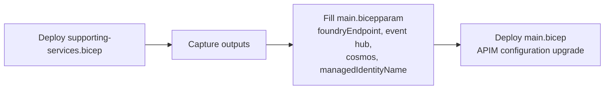

# Upgrading the Gateway Ecosystem (existing APIM + supporting services)

This guide covers the **`supporting-services.bicep`** deployment — the companion to
[`main.bicep`](./main.bicep) in this folder. While `main.bicep` updates an existing API Management
instance's **configuration** (policies, APIs, named values, backends), `supporting-services.bicep`
provisions — or aligns an existing — **ecosystem of services** the gateway depends on:

- User-assigned **managed identities** (APIM + usage pipeline)
- **Monitoring** — Log Analytics + Application Insights (APIM + Function/Logic App)
- **Key Vault**
- **Event Hub** (usage + PII hubs and consumer groups)
- **Cosmos DB** (usage database + containers)
- **Primary AI Foundry** (Content Safety + PII / Language APIs)
- **Storage account + usage-ingestion Logic App**

It exists for one scenario in particular: you have an **API Management instance that was NOT
created by this accelerator** (for example a pre-existing enterprise APIM, or an APIM provisioned by
an earlier version of the Citadel Governance Hub) and you want to bring it — and its surrounding
services — in line with the current accelerator.

> [!IMPORTANT]
> **No network mutation guarantee.** This deployment will **not** change any network configuration
> of your existing APIM or any **bring-your-own (BYO)** supporting service. For existing resources it
> only makes *additive* changes (new Cosmos containers, new Event Hub hubs/consumer groups, named
> values, RBAC role assignments, and consuming the Foundry endpoint). `publicNetworkAccess`, network
> ACLs/firewall rules, private endpoints, and VNet integration of existing resources are left
> untouched. Private-endpoint creation and public/private access settings apply **only to resources
> this template creates**.

---

## Two deployment modes

| Mode | What you set | Result |
|---|---|---|
| **Provision everything (greenfield ecosystem)** | `provisionSupportingServices = true` and all `create*` flags `true` | Creates a fresh set of supporting services next to your existing APIM. |
| **Bring-your-own (configure existing)** | `provisionSupportingServices = true` and selected `create*` flags `false` | References your existing services and applies only the additive accelerator configuration. |
| **APIM-only (no supporting services)** | `provisionSupportingServices = false` | No-op for this template — use only `main.bicep`. This matches an environment where the supporting services already exist and are correctly configured (e.g. an earlier full accelerator deployment). |

You can mix per service — e.g. create a new Cosmos DB and Event Hub, but bring your own Key Vault and
AI Foundry.

---

## Master switch and per-service flags

| Parameter | Default | Purpose |
|---|---|---|
| `provisionSupportingServices` | `false` | Master on/off. When `false`, the template does nothing. |
| `createApimManagedIdentity` | `false` | `false` = reference the identity already attached to your existing APIM (BYO). |
| `deployMonitoring` / `createLogAnalytics` / `createAppInsights` | `true` | Include monitoring; create vs BYO workspace/components. |
| `deployKeyVault` / `createKeyVault` | `true` | Include Key Vault; create vs BYO. |
| `deployEventHub` / `createEventHub` | `true` | Include Event Hub; create namespace vs add hubs to an existing namespace. |
| `deployCosmosDb` / `createCosmosDb` | `true` | Include Cosmos DB; create account vs add database/containers to an existing account. |
| `deployFoundry` / `createFoundry` | `true` | Include AI Foundry; create vs consume an existing endpoint. |
| `deployFoundryModels` | `false` | Opt-in: add model deployments to the Foundry account (otherwise endpoint-only). |
| `deployLogicApp` / `createStorage` | `true` | Include the usage Logic App (+ storage); create vs BYO storage. |
| `usePrivateEndpoints` | `false` | Opt-in private endpoints for **created** resources only. |

---

## Recommended workflow



### 1. Configure and deploy supporting services

Edit [`supporting-services.bicepparam`](./supporting-services.bicepparam), then:

```bash
az deployment group create \
  --name ecosystem-upgrade-$(date +%Y%m%d%H%M) \
  --resource-group <your-resource-group> \
  --template-file supporting-services.bicep \
  --parameters supporting-services.bicepparam
```

### 2. Capture the outputs

```bash
az deployment group show \
  --resource-group <your-resource-group> \
  --name <deployment-name> \
  --query properties.outputs
```

Key outputs to carry into `main.bicepparam`:

| Output | Feeds `main.bicep` parameter |
|---|---|
| `foundryEndpoint` | `aiLanguageServiceUrl`, `contentSafetyServiceUrl` |
| `managedIdentityName` | `managedIdentityName` |
| `eventHubName`, `eventHubPIIName`, `eventHubEndpoint`, `eventHubNamespaceName` | (used by APIM usage logging configuration) |
| `cosmosDbAccountName` | (used by the usage pipeline) |

### 3. Deploy the APIM configuration upgrade

Follow [`README.md`](./README.md) to run `main.bicep` with the captured values.

---

## Challenges for a non-accelerator gateway

Bringing an APIM that the accelerator did not create into alignment surfaces a number of issues that
do not arise on a clean accelerator deployment. Plan for the following.

### 1. Networking and DNS topology is unknown
The accelerator's own modules are **private-endpoint-first** and assume a known VNet, subnets, and
private DNS zones. An arbitrary existing APIM may be public, internal (VNet-injected), behind a
private endpoint, or in a hub-spoke topology you do not control.

- This template defaults to **public network access** for created services so it can run without a
  VNet. This is the simplest path for a proof of concept but is **not** the accelerator's secure
  posture.
- To match the secure posture, set `usePrivateEndpoints = true` and provide the existing
  `vNetName` / `vNetRG` / `privateEndpointSubnetName` plus DNS zone resource IDs in
  `existingPrivateDnsZones`. The subnet and DNS zones **must already exist** — this template does not
  create VNets, subnets, or DNS zones.
- **APIM ↔ backend reachability:** if your APIM is VNet-injected, created public services may not be
  reachable (or vice versa). Ensure routing/firewall/private-endpoint connectivity between APIM and
  each backend before relying on the gateway.

### 2. Managed identity model differs
The accelerator wires a **user-assigned** identity to APIM (for Key Vault, Event Hub, and Cognitive
Services access) and a separate **system-assigned** identity for Key Vault named-value resolution.

- Provide your existing APIM's user-assigned identity name via `apimManagedIdentityName`
  (`createApimManagedIdentity = false`). This template grants that identity the Foundry / Key Vault
  roles it needs.
- The **system-assigned** APIM identity only exists after APIM is created and is not discoverable
  from this template. If you use Key-Vault-backed named values, pass its principal ID via
  `apimSystemAssignedPrincipalId` so it is granted Secrets/Certificate User, or grant it manually.

### 3. RBAC principal replication delays
Freshly created identities can take time to replicate in Microsoft Entra ID. Cosmos DB validates
principals **synchronously** and has no `principalType` hint, so its data-plane role assignment is
deployed in a **separate stage** (`cosmos-sql-role-assignment.bicep`) after the identity exists. If
you still hit a transient *"principal ID … was not found in the AAD tenant"* error, simply re-run the
deployment.

### 4. Event Hub access during provisioning
APIM (especially the v2 SKUs) may need the Event Hub namespace to allow access while the logger is
established. When creating a namespace, this template leaves `eventHubPublicNetworkAccess = 'Enabled'`
by default. Restrict it **after** the gateway logger is confirmed working — and remember that for a
**BYO** namespace this template will never change that setting for you.

### 5. Existing-resource naming and collisions
For BYO services you supply explicit names; for created services the template derives names from
`abbreviations.json` + a `resourceToken` (hash of the resource group ID). If your environment already
contains resources with conflicting names, override the relevant `*Name` parameters to avoid
collisions or accidental references to the wrong resource.

### 6. Logic App workflow content
This template provisions the usage-ingestion Logic App **infrastructure** (hosting plan, app
settings, identity, RBAC, Azure Monitor connection) and points it at your storage, Cosmos DB, and
Event Hub. The **workflow definitions** themselves are deployed separately (via `azd deploy`, the
Logic App source under `src/`, or your own pipeline). VNet integration is optional — supply
`logicAppSubnetId` to integrate, or leave it blank to run over public networking.

### 7. AI Foundry as a backend vs full model host
For BYO Foundry the template consumes only the **endpoint** (for Content Safety and PII / Language)
and grants APIM the Cognitive Services User role. It does **not** add model deployments unless you set
`deployFoundryModels = true`. If your existing Foundry already hosts the models you route to, leave
this off and configure those backends through `main.bicep`'s `llmBackendConfig`.

### 8. Idempotency and re-runs
The template is safe to re-run. RBAC assignments are deterministically named (`guid(...)`), and
additive resources (containers, hubs, consumer groups) are upserted. Validate with a what-if first:

```bash
az deployment group what-if \
  --resource-group <your-resource-group> \
  --template-file supporting-services.bicep \
  --parameters supporting-services.bicepparam
```

For BYO services, confirm the what-if shows **only additive changes** and **no network property
diffs** on existing resources before applying.

---

## File structure

```
apim-gateway-upgrade/
├── main.bicep                          # APIM configuration upgrade (policies, APIs, named values)
├── main.bicepparam
├── supporting-services.bicep           # Gateway ecosystem provisioning / alignment (this guide)
├── supporting-services.bicepparam
├── services/                           # Upgrade-scoped wrapper modules (create-or-BYO, optional PE)
│   ├── managed-identity.bicep
│   ├── monitoring.bicep
│   ├── key-vault.bicep
│   ├── event-hub.bicep
│   ├── cosmos-db.bicep
│   ├── foundry.bicep
│   ├── storage.bicep
│   └── logic-app.bicep
├── README.md                           # main.bicep reference
└── gateway-ecosystem-upgrade-guide.md  # This guide
```

The wrapper modules under `services/` are intentionally **separate** from the shared accelerator
modules in `bicep/infra/modules/`. The shared modules are private-endpoint-first and always create
private endpoints; the wrappers add create-or-BYO behaviour and make private endpoints opt-in,
without modifying (and therefore without risk to) the main accelerator deployment.
